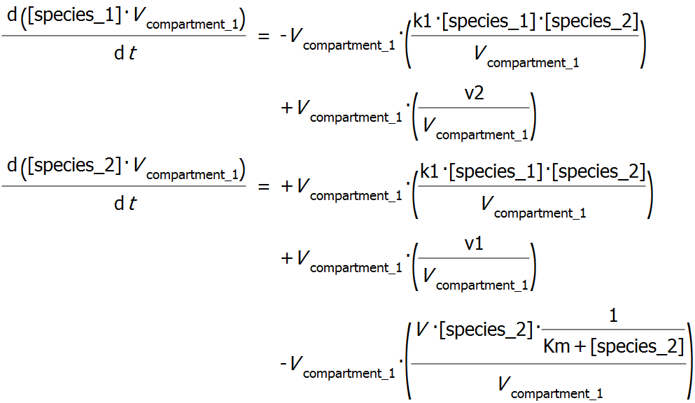
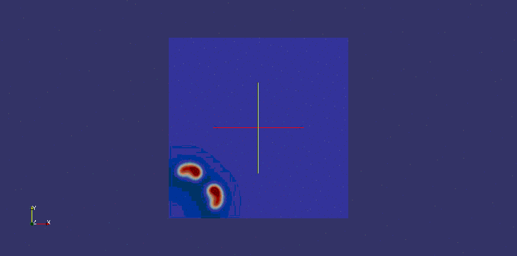

# Dune Test	
This repository holds a basic DUNE module that solves a very basic Reaction Diffusion Problem of the two ODE's:

With parameters: 
	
* k1  = 1
* v1 = 0.06
* v2 = 0.12
* V = 0.5
* Km = 0.1

The values of these parameters (and the diffusion coefficients) is read from the configuration file that is placed next to the binary. (The template for these files is in `dune-test/src/turing_problem/turing.conf` and `dune-test/src/turing_problem_ccfv/turing_ccv.conf` respectively). 

## Setup

Compilation of the project is possible on CYGWIN, OSX and Linux. As dependencies only `cmake` and `curl` are needed. From there simply run first: 

	./cloneAll.sh

which will checkout all Dune packages from their respective Dune repositories here on github. Next it might be possible to apply some patches: 

	cd dune-common && git apply ../patches/dune_common_ignore_fortran.patch && cd .. 
	cd dune-grid && git apply ../patches/dune_grid_cygwin.patch && cd ..
	cd dune-pdelab && git apply ../patches/dune_pdelab_new_cmake.patch && cd ..

After that all should be ready and 

	./compileDune.sh

should compile DUNE as well as three grid libraries (ALUgrid, Alberta, SuperLU) into `./install`. Next: 

	./compileTest.sh 

ought to compile the Dune-test module, and you should be able to run it by invoking 

	cd build-test/src
	./dune_test

## Running the example
Once the example is compiled, two binaries ought to have been created: `src/turing_problem/turing_problem` and `src/turing_problem_ccfv/turing_ccfv`. To run them simply change into the directory and execute these binaries. Feel free to tweak the `.conf` files to change parameters of the runs. After each iteration the exectuables write `.vtu` files into the `./vtk` folder. These files can be viewed with [paraview](http://www.paraview.org/). Below an example rendering.  

## Result 
If all went well, you ought to see a simulation like the one below: 

 

Finally, I have another example working that restricts the geometry of the domain, so something else but the Unit grid can be used. This makes use of the [dune-multidomaingrid](http://users.dune-project.org/projects/dune-multidomaingrid). A new example has been added and is built automatically by cmake (though you will need to have dune-multidomaingrid and boost installed for it to work). 

## Acknowledgments
The model is based of a C++ implementation by Sven Sahle. The original Model has been developed by Pavel Hron.